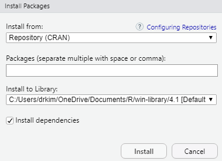
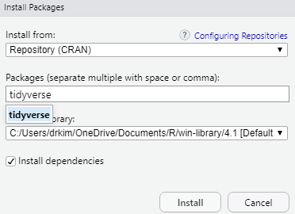
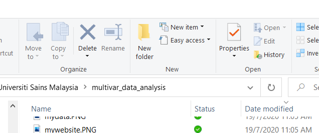

# Data Visualization

## Introduction 

Data visualization is viewed by many disciplines as a modern equivalent of visual communication. It involves the creation and study of the visual representation of data. Data visualization requires "information that has been abstracted in some schematic form, including attributes or variables for the units of information". You can read more about data visualization here <https://en.m.wikipedia.org/wiki/Data_visualization> and here <https://en.m.wikipedia.org/wiki/Michael_Friendly>  

In this chapter, we want to achieve these objectives:

1. To introduce concept of data visualization
2. To describe ingredients for good graphics
3. To generate plots using **ggplot** packages
4. To save plots in different format and settings


## History and objectives of Data Visualization

In his 1983 book which carried the title *The Visual Display of Quantitative Information*, the author Edward Tufte defines **graphical displays** and principles for effective graphical display. The book mentioned that "Excellence in statistical graphics consists of complex ideas communicated with clarity, precision and efficiency."

Visualization is the process of  representing data graphically and  interacting with these representations. The objective is to gain insight into the data. Some of the processes are outlined here <http://researcher.watson.ibm.com/researcher/view_group.php?id=143>

## Ingredients for Good Graphics

We require these features to make good graphics:

1.  Good data
2.  Priorities on substance rather than methodology, graphic design, the technology of graphic production or something else
3.  No distortion to what the data has to say
4.  Presence of many numbers in a small space
5.  Coherence for large data sets
6.  They encourage the eye to compare different pieces of data
7.  They reveal data at several levels of detail, from a broad overview to the fine structure
8.  Serve a reasonably clear purpose: description, exploration, tabulation or decoration
9.  Be closely integrated with the statistical and verbal descriptions of a data set.

## Graphics Packages in R

There are many **graphics packages** in R. Some packages perform general data visualization or graphical taskss. The others provide specific graphics for certain statistical or data analyses. 

The popular general purpose graphics packages in R are:

1.  **graphics** : a base R package, which means it is loaded everytime we open R
2.  **ggplot2** : a user-contributed package by RStudio
3.  **lattice** : a user-contributed package


Except for **graphics** package (a base R package), other packages need to downloaded and installed into your R library. A few examples more specific graphical packages include:

1.  **survminer::ggsurvlot** : The **survminer** R package provides functions for facilitating survival analysis and visualization. 
2.  **sjPlot** : Collection of plotting and table output functions for data visualization


## The **ggplot2** Package

For this book, we will focus on using the **ggplot2** package. The **ggplot2** package is an elegant, easy and versatile general graphics package in R. It implements the **grammar of graphics** concept. The advantage of this concept is that, it fasten the process of learning graphics. It also facilitates the process of creating complex graphics

To work with **ggplot2**, remember to

- start R codes with `ggplot()`
- identify which data to plot: `data = Your Data`
- state variables to plot: `aes(x = Variable on x-axis, y = Variable on y-axis )`
- choose type of graph: for example `geom_histogram()` for histogram, and `geom_points()` for scatterplots

The official website for ggplot2 is here <http://ggplot2.org/>. It has excellent resources. It states that:

*ggplot2 is a plotting system for R, based on the grammar of graphics, which tries to take the good parts of base and lattice graphics and none of the bad parts. It takes care of many of the fiddly details that make plotting a hassle (like drawing legends) as well as providing a powerful model of graphics that makes it easy to produce complex multi-layered graphics.*

## Preparation

### Create a New RStudio Project 

It is always recommended that to start working on data analysis in RStudio, you create first a new project.

Go to File, then click New Project. 

You can create a new R project based on existing directory. This method is useful because an RStudio project keep your data, your analysis, and outputs in a clean dedicated folder or sets of folders.If you do not want to create a new project, then make sure you are inside the correct directory (the working directory). The working directory is a folder where you store. 

Type `getwd()` in your Console to display your working directory. Inside your working directory, you should see and keep

1.  dataset or datasets
2.  outputs - plots 
3.  codes (R scripts `.R`, R markdown files `.Rmd`)

### Important Questions when Making Graphs

You must ask yourselves these:

1.  Which variable or variables do I want to plot?
2.  What is (or are) the type of that variable? 
- Are they factor (categorical) variables ? 
- Are they numerical variables?
3.  Am I going to plot 
- a single variable?
- two variables together?
- three variables together?


### Read Data

The common data formats include

1.  comma separated files (`.csv`)
2.  MS Excel file (`.xlsx`)
3.  SPSS file (`.sav`)
4.  Stata file (`.dta`)
5.  SAS file 

Packages that read these data include **haven** and **rio** packages. Below are the functions to read SAS, SPSS and Stata file using the **haven** package. 

1.  SAS: `read_sas()` reads .sas7bdat + .sas7bcat files and read_xpt() reads SAS transport files (version 5 and version 8). write_sas() writes .sas7bdat files.
2.  SPSS: `read_sav()` reads .sav files and read_por() reads the older .por files. write_sav() writes .sav files.
3.  Stata: `read_dta()` reads .dta files (up to version 15). write_dta() writes .dta files (versions 8-15).

Sometime, we may want to import data from databases. For beginners, this experience is less common. However, the skill to import data from databases are getting more important and more common. Fortunately, R can easily import and read these data. Some examples of common databases format are:

1.  MySQL
2.  SQLite
3.  Postgresql
4.  Mariadb


### Load the Library

The **ggplot2** package is one of the core member of **tidyverse** metapackage (<https://www.tidyverse.org/>). So, if we load the **tidyverse** package, it means we are also loading other packages under the **tidyverse** metapackage: which include **dplyr**, **readr**, **ggplot2**. 

Loading a package will give you access to

1.  help pages of the package
2.  functions available in the package
3.  sample datasets (not all packages contain this feature)

We will also load the **here** package. This is useful to point to the codes to a specific folder in the project space. We will see this in action later. 


```r
library(tidyverse)
```

```
## -- Attaching packages --------------------------------------- tidyverse 1.3.1 --
```

```
## v ggplot2 3.3.5     v purrr   0.3.4
## v tibble  3.1.6     v dplyr   1.0.7
## v tidyr   1.1.4     v stringr 1.4.0
## v readr   2.1.1     v forcats 0.5.1
```

```
## Warning: package 'tibble' was built under R version 4.1.2
```

```
## -- Conflicts ------------------------------------------ tidyverse_conflicts() --
## x dplyr::filter() masks stats::filter()
## x dplyr::lag()    masks stats::lag()
```

```r
library(here)
```

```
## here() starts at C:/Tengku/Sync_PC_Laptop/tulis-buku/multivariable-analysis/fork-profKIM/multivar_data_analysis
```

If you run the code and you get this message *there is no package called tidyverse*, you need to install the **tidyverse** package on your R IDE. 

To install the package, type `install.package("tidyverse")` in the Console. Once the installation is complete, type `library(tidyverse)` to load the package.

Alternatively, you can use the GUI to install the package:



Now, type the package you want to install. For example you want to install the **tidyverse** package



### Read Dataset

For now, we will use two datasets: 

a. the built-in dataset in the **gapminder** package. You can read more about *gapminder* from <https://www.gapminder.org/>. The gapminder website contains many useful datasets and show wonderful graphics. It is made popular by Dr Hans Rosling.
b. the dataset of patients admitted with peptic ulcer disease `peptic_ulcer.xlsx`. It is in the MS Excel format.

To load the **gapminder** package, type 


```r
library(gapminder)
```

call the data *gapminder* into R and browse the first 6 observations of the *gapminder* data. The codes below shows

- assigning gapminder as a dataset 
- a pipe that connects two codes (`gapminder` and `slice`)
- a function called `slice()` that select rows of the dataset


```r
gapminder <- gapminder
gapminder %>% 
  slice(1:4)
```

```
## # A tibble: 4 x 6
##   country     continent  year lifeExp      pop gdpPercap
##   <fct>       <fct>     <int>   <dbl>    <int>     <dbl>
## 1 Afghanistan Asia       1952    28.8  8425333      779.
## 2 Afghanistan Asia       1957    30.3  9240934      821.
## 3 Afghanistan Asia       1962    32.0 10267083      853.
## 4 Afghanistan Asia       1967    34.0 11537966      836.
```

We can list the variables and look at the type of the variables in the gapminder dataset


```r
glimpse(gapminder)
```

```
## Rows: 1,704
## Columns: 6
## $ country   <fct> "Afghanistan", "Afghanistan", "Afghanistan", "Afghanistan", ~
## $ continent <fct> Asia, Asia, Asia, Asia, Asia, Asia, Asia, Asia, Asia, Asia, ~
## $ year      <int> 1952, 1957, 1962, 1967, 1972, 1977, 1982, 1987, 1992, 1997, ~
## $ lifeExp   <dbl> 28.801, 30.332, 31.997, 34.020, 36.088, 38.438, 39.854, 40.8~
## $ pop       <int> 8425333, 9240934, 10267083, 11537966, 13079460, 14880372, 12~
## $ gdpPercap <dbl> 779.4453, 820.8530, 853.1007, 836.1971, 739.9811, 786.1134, ~
```

The *gapminder* data have

1.  Six (6) variables
2.  A total of 1704 observations
3.  Two factor variables, 2 integer variables and 2 numeric (`dbl`) variables

We can examine the basic statistics of the gapminder datasets by using `summary()`. This function will list

1.  the frequencies 
2.  some descriptive statistics: min, 1st quartile, median, mean, 3rd quartile and max


```r
summary(gapminder)
```

```
##         country        continent        year         lifeExp     
##  Afghanistan:  12   Africa  :624   Min.   :1952   Min.   :23.60  
##  Albania    :  12   Americas:300   1st Qu.:1966   1st Qu.:48.20  
##  Algeria    :  12   Asia    :396   Median :1980   Median :60.71  
##  Angola     :  12   Europe  :360   Mean   :1980   Mean   :59.47  
##  Argentina  :  12   Oceania : 24   3rd Qu.:1993   3rd Qu.:70.85  
##  Australia  :  12                  Max.   :2007   Max.   :82.60  
##  (Other)    :1632                                                
##       pop              gdpPercap       
##  Min.   :6.001e+04   Min.   :   241.2  
##  1st Qu.:2.794e+06   1st Qu.:  1202.1  
##  Median :7.024e+06   Median :  3531.8  
##  Mean   :2.960e+07   Mean   :  7215.3  
##  3rd Qu.:1.959e+07   3rd Qu.:  9325.5  
##  Max.   :1.319e+09   Max.   :113523.1  
## 
```

To know more about the package, we can use the $?$ mark 


```r
?gapminder
```

```
## starting httpd help server ... done
```

## Basic Plots

Let us start by creating a simple plot using these arguments:

- data : `data = gapminder`
- variables : `x = year`, `y =  lifeExp`
- graph scatterplot : `geom_point()`

In **ggplot2** which is a package under **tidyverse** package, we may use the $+$ sign to connect the function. And in R, your codes can span multiple lines. This will increase the visibility of the codes.  


```r
ggplot(data = gapminder) +
  geom_point(mapping = aes(x = year, y = lifeExp))
```

<!-- --> 

Now, we can see 

1. a scatterplot
2. the scatterplot shows the relationship between year and life expectancy. 
2. as variable year advances, the life expectancy increases. 

What do the codes tell us?

- the `ggplot()` tells R to be ready to make plot from a specified data. 
- And `geom_point()` tells R to make a scatter plot.

More resources about **ggplot2** package is available here https://ggplot2.tidyverse.org/reference/ggplot.html 

## Adding another variable

We can see that the variables we want to plot are specified by `aes()`. We can add a third variable to make a more complex plot. For example:

1.  data : `data = gapminder`
2.  variables : `x = year`, `y = lifeExp`, `colour = continent`

For this, the objective to create plot might be to see the relationship between year and life expectancy based on continent.


```r
ggplot(data = gapminder) +
  geom_point(mapping = aes(x = year, 
                           y = lifeExp, 
                           colour = continent))
```

<!-- --> 

What can you see from the scatterplot? You may notice that

1.  Europe countries have high life expectancy
2.  Africa countries have lower life expectancy
3.  One Asia country looks like an outlier (very low life expectancy)
4.  One Africa country looks like an outlier (very low life expectancy)


Now, we will replace the third variable with Gross Domestic Product (gdpPercap) and make the plot correlates with the size of gdpPerCap


```r
ggplot(data = gapminder) +
  geom_point(mapping = aes(x = year, 
                           y = lifeExp, 
                           size = gdpPercap))
```

<!-- --> 

*ggplot2* will automatically assign a unique level of the aesthetic (here a unique color) to each unique value of the variable, a process known as scaling. *ggplot2* will also add a legend that explains which levels correspond to which values. The plot suggests that with higher gdpPerCap, there is also longer lifeExp. 

Instead of using colour, we can use different shapes. This is useful especially in the instances where there is no facility to print out colourful plots.


```r
ggplot(data = gapminder) +
  geom_point(mapping = aes(x = year, 
                           y = lifeExp, 
                           shape = continent))
```

<!-- --> 

But, see what will happen if we set the colour and shape like below but outside the `aes` parentheses. For example, let set the parameter colour to `blue`


```r
ggplot(data = gapminder) +
  geom_point(mapping = aes(x = year, y = lifeExp), 
             colour = 'blue')
```

<!-- --> 


And then parameter shape to plus (which is represented by number 3).  


```r
ggplot(data = gapminder) +
  geom_point(mapping = aes(x = year, y = lifeExp), 
             shape = 3)
```

<!-- --> 

We may wonder what number corresponds to what type of shape. We can type $?pch$. And we will see in the Viewer pane, the explanation about the shape available in R. It also shows what number that corresponds to what shape.


## Making Subplots

We can split our plots based on a factor variable and make subplots using the `facet()`. For example, if we want to make subplots based on continents, then we need to set these parameters:

- data = gapminder
- variable `year` on the x-axis and `lifeExp` on the y-axis
- split the plot based on continent
- set the number of rows for the plot at 3


```r
ggplot(data = gapminder) +
  geom_point(mapping = aes(x = year, y = lifeExp)) + 
  facet_wrap(~ continent, nrow = 3)
```

<!-- --> 

Now, what happen if we change the value for the `nrow`


```r
ggplot(data = gapminder) +
  geom_point(mapping = aes(x = year, y = lifeExp)) + 
  facet_wrap(~ continent, nrow = 2)
```

<!-- --> 

## Overlaying Plots

Each `geom_X()` in ggplot2 indicates different visual objects.

This is a scatterplot


```r
ggplot(data = gapminder) +
  geom_point(mapping = aes(x = gdpPercap, y = lifeExp))
```

<!-- --> 
 

This is a smooth line plot


```r
ggplot(data = gapminder) +
  geom_smooth(mapping = aes(x = gdpPercap, y = lifeExp))
```

```
## `geom_smooth()` using method = 'gam' and formula 'y ~ s(x, bs = "cs")'
```

<!-- --> 

And we can regenerate the smooth plot based on continent using the `linetype()`. We will also use `log(gdpPercap)` to reduce the skewness of the data.


```r
ggplot(data = gapminder) +
  geom_smooth(mapping = aes(x = log(gdpPercap), 
                            y = lifeExp, 
                            linetype = continent))
```

```
## `geom_smooth()` using method = 'loess' and formula 'y ~ x'
```

<!-- --> 

Another smooth plot but setting the parameter for colour


```r
ggplot(data = gapminder) +
  geom_smooth(mapping = aes(x = log(gdpPercap), 
                            y = lifeExp, 
                            colour = continent))
```

```
## `geom_smooth()` using method = 'loess' and formula 'y ~ x'
```

<!-- --> 


## Combining Different Plots

We can combine more than one `geoms` (type of plots) to overlay plots. The trick is to use multiple `geoms` in a single line of R code


```r
ggplot(data = gapminder) +
  geom_point(mapping = aes(x = log(gdpPercap), y = lifeExp)) +
  geom_smooth(mapping = aes(x = log(gdpPercap), y = lifeExp))
```

```
## `geom_smooth()` using method = 'gam' and formula 'y ~ s(x, bs = "cs")'
```

<!-- --> 

The codes above show duplication or repetition. To avoid this, we can pass the mapping to `ggplot()`. 


```r
ggplot(data = gapminder, 
       mapping = aes(x = log(gdpPercap), y = lifeExp)) +
  geom_point() +
  geom_smooth()
```

```
## `geom_smooth()` using method = 'gam' and formula 'y ~ s(x, bs = "cs")'
```

<!-- --> 

And we can expand this to make scatterplot shows different colour for continent
 

```r
ggplot(data = gapminder, 
       mapping = aes(x = log(gdpPercap), y = lifeExp)) +
  geom_point(mapping = aes(colour = continent)) +
  geom_smooth()
```

```
## `geom_smooth()` using method = 'gam' and formula 'y ~ s(x, bs = "cs")'
```

<!-- --> 

Or expand this to make the smooth plot shows different colour for continent


```r
ggplot(data = gapminder, 
       mapping = aes(x = log(gdpPercap), y = lifeExp)) +
  geom_point() +
  geom_smooth(mapping = aes(colour = continent))
```

```
## `geom_smooth()` using method = 'loess' and formula 'y ~ x'
```

<!-- --> 

Or both the scatterplot and the smoothplot


```r
ggplot(data = gapminder, 
       mapping = aes(x = log(gdpPercap), y = lifeExp)) +
  geom_point(mapping = aes(shape = continent)) +
  geom_smooth(mapping = aes(colour = continent))
```

```
## `geom_smooth()` using method = 'loess' and formula 'y ~ x'
```

<!-- --> 


## Statistical Transformation

Let us create a bar chart, with y axis as the frequency.


```r
ggplot(data = gapminder) +
  geom_bar(mapping = aes(x = continent))
```

<!-- --> 

If we want the y-axis to show proportion, we can use these codes


```r
ggplot(data = gapminder) +
  geom_bar(mapping = aes(x = continent, y = ..prop..,
                         group = 1))
```

<!-- --> 


## Customizing Title

We can customize many aspects of the plot using ggplot package. For example, from gapminder dataset, we choose gdpPerCap and log it (to reduce skewness) and lifeExpy, and make a scatterplot. 

Let's name the plot as `mypop`


```r
mypop <- ggplot(data = gapminder, 
                mapping = aes(x = log(gdpPercap), 
                              y = lifeExp)) +
  geom_point() +
  geom_smooth(mapping = aes(colour = continent))
mypop
```

```
## `geom_smooth()` using method = 'loess' and formula 'y ~ x'
```

<!-- --> 

You will notice that there is no title in the plot. So we will add a title to the plot.


```r
mypop + 
  ggtitle("GDP (in log) and life expectancy")
```

```
## `geom_smooth()` using method = 'loess' and formula 'y ~ x'
```

<!-- --> 

To make the title appear in multiple lines, we can add `\n`


```r
mypop + ggtitle("GDP (in log) and life expectancy:
                \nData from Gapminder")
```

```
## `geom_smooth()` using method = 'loess' and formula 'y ~ x'
```

<!-- --> 


## Adjusting Axes

We can specify the tick marks

1.  min = 0
2.  max = 12
3.  interval = 1


```r
mypop + 
  scale_x_continuous(breaks = seq(0,12,1))
```

```
## `geom_smooth()` using method = 'loess' and formula 'y ~ x'
```

<!-- --> 

And we can label the x-axis and y-axis


```r
mypop + 
  ggtitle("GDP (in log) and life expectancy:
                \nData from Gapminder") + 
  ylab("Life Expentancy") + 
  xlab("Percapita GDP in log")
```

```
## `geom_smooth()` using method = 'loess' and formula 'y ~ x'
```

<!-- --> 

## Choosing Themes

The default is gray theme or `theme_gray()`. But there are many other themes. One of the popular themes is the the black and white theme.


```r
mypop + 
  theme_bw()
```

```
## `geom_smooth()` using method = 'loess' and formula 'y ~ x'
```

<!-- --> 

This is the classic theme


```r
mypop + 
  theme_classic()
```

```
## `geom_smooth()` using method = 'loess' and formula 'y ~ x'
```

<!-- --> 


## Saving Plots 

In R, you can save the plot into different graphical format. You can also set other parameters such as the `dpi` and the size for the plot (height and width). One of the preferred formats for saving a plot is as a PDF format.

Here, we will show how to save plots in different format in R. In this example, let us use the object we created before (`mypop`). We will add 

- title
- x label
- y label
- classic theme

And then create a new graphical object `myplot`


```r
myplot <- 
  mypop + 
  ggtitle("GDP (in log) and life expectancy:
                \nData from Gapminder") + 
  ylab("Life Expentancy") + 
  xlab("Percapita GDP in log") +
  scale_x_continuous(breaks = seq(0,12,1)) +
  theme_classic()
myplot
```

```
## `geom_smooth()` using method = 'loess' and formula 'y ~ x'
```

<!-- --> 


We now can see a nice plot. And next, we want to save the plot (currently on the screen) to these formats:

1.  `pdf` format
2.  `png` format
3.  `jpg` format

And we want to save the plots in a folder named as `plots`. To do this

- create a folder and name it as `plot`




We are using the `here()` function now. If you notice, we use a new package called **here**. This is a very useful package that can help get or save files in the correct path (including folder) even when we are using different machines. If we are not clear about this, do you remember any circumstances when the drive name changes automatically (especially when using thumbdrive) in different computers. By using `here()` from the **here** package, we will always get to the correct path or folder. 

To save the plots in the directory named as plots, we can do these: 


```r
ggsave(plot = myplot, 
       here("plots","my_pdf_plot.pdf"))
```

```
## Saving 6.5 x 4.5 in image
```

```
## `geom_smooth()` using method = 'loess' and formula 'y ~ x'
```

```r
ggsave(plot = myplot, 
       here("plots","my_png_plot.png")) 
```

```
## Saving 6.5 x 4.5 in image
## `geom_smooth()` using method = 'loess' and formula 'y ~ x'
```

```r
ggsave(plot = myplot, 
       here("plots","my_jpg_plot.jpg"))
```

```
## Saving 6.5 x 4.5 in image
## `geom_smooth()` using method = 'loess' and formula 'y ~ x'
```


If we want to add more customization before saving the plot, for example, we want to set these parameters:  

1.  width = 10 cm (or you can use `in`)
2.  height = 6 cm (or you can use `in`)
3.  dpi = 150. dpi is dots per inch

Now, you can run these codes 


```r
ggsave(plot = myplot, 
       here('plots','my_pdf_plot2.pdf'), 
       width = 10, height = 6, units = "in",
       dpi = 150, device = 'pdf')
```

```
## `geom_smooth()` using method = 'loess' and formula 'y ~ x'
```

```r
ggsave(plot = myplot, 
       here('plots','my_png_plot2.png'), 
       width = 10, height = 6, units = "cm", 
       dpi = 150, device = 'png')
```

```
## `geom_smooth()` using method = 'loess' and formula 'y ~ x'
```

```r
ggsave(plot = myplot, 
       here("plots","my_jpg_plot2.jpg"), 
       width = 10, height = 6, units = "cm",
       dpi = 150, device = 'jpg')
```

```
## `geom_smooth()` using method = 'loess' and formula 'y ~ x'
```


