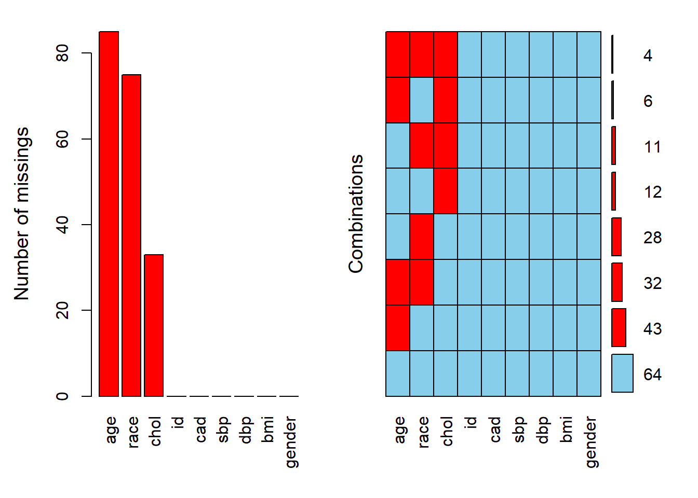
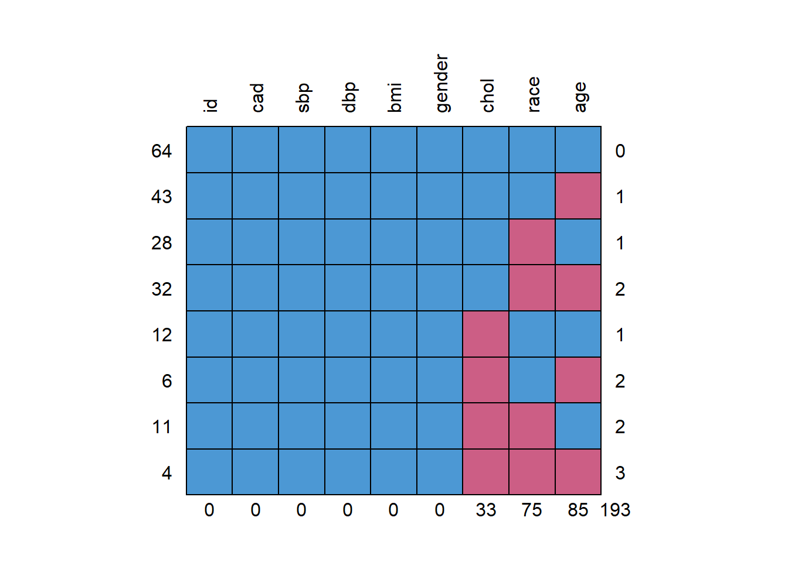
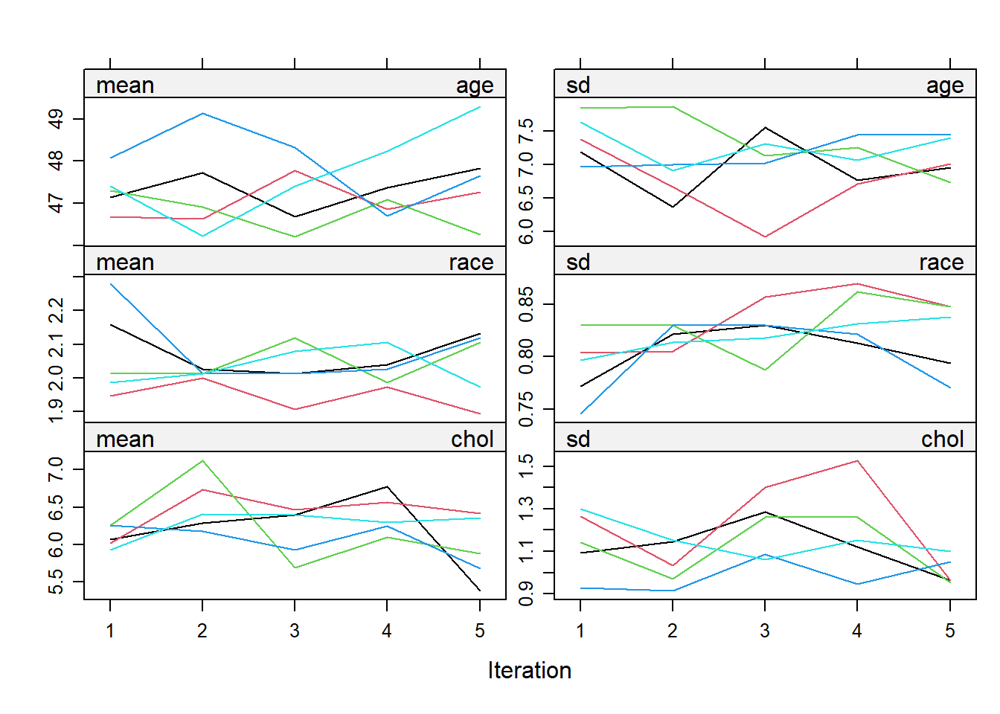
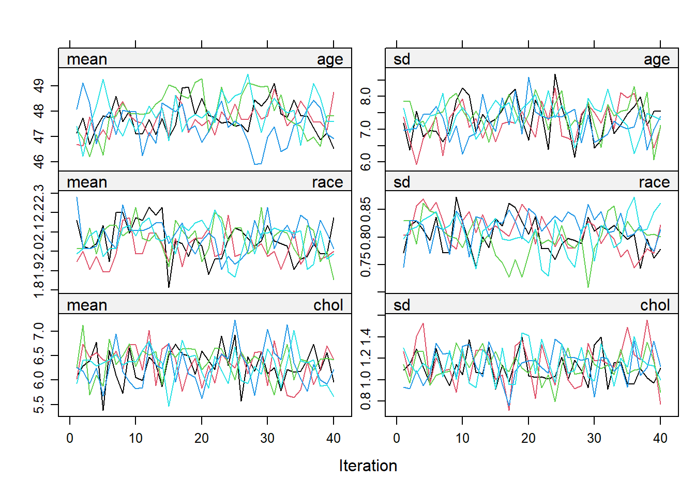

---
output:
  pdf_document: default
  html_document: default
bibliography: missing-data.bib
nocite: '@*'
---

# Missing data

## Introduction

### Background 

Missing data data is quite a common issue in research. The causes of missing data should always be investigated and more data should be collected if possible. There are three types of missing data:

1.  Missing completely at random (MCAR)\
2.  Missing at random (MAR)\
3.  Missing not at random (MNAR)

<center>

{width=65%}

</center>

Missing data (*R*) is classified as MCAR if the cause of missing data (*Z*) is unrelated to the data (*Y*). For example, medical records that is lost due to flood and laboratory equipment malfunction. In other words, the data is missing totally by chance. We can relate this example to the figure above, the cause, *Z* is not related to the data itself that have been observed, *Y*, but only related to the data that is missing, *R*. MCAR is ideal and more convenient, though MAR is more common and realistic. 

Missing data (*R*) is said to be MAR if the cause of missing data (*Z*) is related to other observed value (*X*), but not to the variable itself (*Y*). For example, an older person is more likely complete a survey compared to the younger person. So, the missingness is related to age, a variable that has been observed. Similarly, if information on income is more likely to be missing for older individuals as they are more cautious to reveal a sensitive information as opposed to younger individuals. Thus, the missingness is related to age, which should be a variable that we have information on. So, this missingness is considered as MAR. Another example of MAR is missing a certain variable due to the old medical form do not request this information. However, a new updated medical form request this information. As the missingness is not related the variable itself and we have the information whether the patients use an old or a new medical form, we can classify this missingness as MAR. We can see from all the examples that the cause of missing data, *Z* is related to other variable, *X*, but not to the variable itself, *Y* as illustrated in the figure.

Lastly, the missing data (*R*) is considered MNAR if the cause of missing data (*Z*) is related to the variable itself (*Y*) and to other variables (*X*) as well. Also, the missingness is considered MNAR if the causes completely unknown to us. In other words, we can not logically deduce that the missing data fit MCAR or MAR types. For example, missing a weight information for an obese individuals as the normal weighing scale may not able to weigh the individuals. Thus, the missing weight values (*R*) is considered MNAR as the missingness is related the variable itself (*Y*). However, we can never be sure of this without a further investigation about the mechanism of missingnness and its causes. MNAR is the most problematic type among the three. There are a few approaches to differentiate between MCAR and MAR-MNAR. However, an approach to differentiate between MAR and MNAR has yet to be proposed. Thus, we need to use a logical reasoning to differentiate between the two types.

### Objectives

At the end of the chapter, the reader will be able to:

-   To perform a simple imputation\
-   To perform a single imputation\
-   To perform a multiple imputation

## Preliminaries

### Packages

We will use these packages:

-   `mice`: for the single and multiple imputation\
-   `VIM`: for missing data exploration\
-   `naniar`: for missing data exploration\
-   `tidyverse`: for data wrangling and manipulation\
-   `gtsummary`: to provide a nice result in a table


```r
library(mice)
library(VIM)
library(naniar)
library(tidyverse)
library(gtsummary)
```

### Dataset

We going to use the coronary dataset that we used previously in linear regression chapter. However, this dataset have been altered to generate a missing values in it.


```r
coroNA <- read_csv(here::here('data', "coronaryNA.csv"))
```

Next, we going to transform the all the character variables into a factor. `mutate_if()` will recognise all character variables and transform it into a factor.


```r
coroNA <- 
  coroNA %>% 
  mutate_if(is.character, as.factor)
summary(coroNA)
```

```
##       age             race         chol             id             cad     
##  Min.   :33.00   chinese:31   Min.   :4.000   Min.   :   1.0   cad   : 37  
##  1st Qu.:43.00   indian :45   1st Qu.:5.362   1st Qu.: 901.5   no cad:163  
##  Median :48.00   malay  :49   Median :6.050   Median :2243.5               
##  Mean   :48.02   NA's   :75   Mean   :6.114   Mean   :2218.3               
##  3rd Qu.:53.00                3rd Qu.:6.875   3rd Qu.:3346.8               
##  Max.   :62.00                Max.   :9.350   Max.   :4696.0               
##  NA's   :85                   NA's   :33                                   
##       sbp             dbp              bmi          gender   
##  Min.   : 88.0   Min.   : 56.00   Min.   :28.99   man  :100  
##  1st Qu.:115.0   1st Qu.: 72.00   1st Qu.:36.10   woman:100  
##  Median :126.0   Median : 80.00   Median :37.80              
##  Mean   :130.2   Mean   : 82.31   Mean   :37.45              
##  3rd Qu.:144.0   3rd Qu.: 92.00   3rd Qu.:39.20              
##  Max.   :187.0   Max.   :120.00   Max.   :45.03              
## 
```

Missing data in R is denoted by `NA`. Further information about `NA` can be assessed by typing `?NA` in the RStudio console. As seen above, the three variables; age, race and chol have missing values. We can further confirm this using a `anyNA()`.


```r
anyNA(coroNA)
```

```
## [1] TRUE
```

True indicates a presence of missing values in our data. Thus, we can further explore the missing values in our data.

## Exploring missing data

The total percentage of missing values in our data is 10.7%. 


```r
prop_miss(coroNA)
```

```
## [1] 0.1072222
```

Percentage of missing data by variable:


```r
miss_var_summary(coroNA)
```

```
## # A tibble: 9 x 3
##   variable n_miss pct_miss
##   <chr>     <int>    <dbl>
## 1 age          85     42.5
## 2 race         75     37.5
## 3 chol         33     16.5
## 4 id            0      0  
## 5 cad           0      0  
## 6 sbp           0      0  
## 7 dbp           0      0  
## 8 bmi           0      0  
## 9 gender        0      0
```

Both `prop_miss()` and `miss_var_summary()` are from `naniar` package. Subsequently, We can explore the pattern of missing data using `aggr()` function from `VIM`. The `numbers` and `prop` arguments indicate that we want the missing information on the y-axis of the plot to be in number not proportion.


```r
aggr(coroNA, numbers = TRUE, prop = FALSE)
```



The labels on x-axis are according to the column names in the dataset. In term of pattern of missingness, about 43 observation are missing age values alone.

Similarly, the pattern of missing data can be explore through `md.pattern()` from `mice` package. The `rotate.names` argument set to true to specify the direction of the variable names on top of the plot horizontally.


```r
md.pattern(coroNA, rotate.names = TRUE)
```



```
##    id cad sbp dbp bmi gender chol race age    
## 64  1   1   1   1   1      1    1    1   1   0
## 43  1   1   1   1   1      1    1    1   0   1
## 28  1   1   1   1   1      1    1    0   1   1
## 32  1   1   1   1   1      1    1    0   0   2
## 12  1   1   1   1   1      1    0    1   1   1
## 6   1   1   1   1   1      1    0    1   0   2
## 11  1   1   1   1   1      1    0    0   1   2
## 4   1   1   1   1   1      1    0    0   0   3
##     0   0   0   0   0      0   33   75  85 193
```

Additionally, we can assess the correlation:

1. Between variables with missing values\
2. Between variables with missing values and variable with non-missing values

First, we need to take variables with missing values only. Then, we code a missing value with 1 and non-missing value with 0.


```r
dummyNA <- 
  as.data.frame(abs(is.na(coroNA))) %>% 
  select(age, race, chol) # pick variable with missing values only
head(dummyNA)
```

```
##   age race chol
## 1   0    0    0
## 2   0    0    0
## 3   0    0    0
## 4   1    0    0
## 5   1    0    0
## 6   0    0    0
```

We assess the correlation between variables with missing values.


```r
cor(dummyNA) %>% round(digits = 2)
```

```
##        age race  chol
## age   1.00 0.09 -0.11
## race  0.09 1.00  0.07
## chol -0.11 0.07  1.00
```

There is no strong correlation between variables with missing values. We can conclude that the missing values in one variable is not related to the missing values in another variable. 

The second correlation is between variables with missing values and variable with non-missing values. First, we need to change the categorical variable into a numeric value to get a correlation for all the variables.


```r
cor(coroNA %>% mutate_if(is.factor, as.numeric), dummyNA, use = "pairwise.complete.obs") %>% 
  round(digits = 2)
```

```
## Warning in cor(coroNA %>% mutate_if(is.factor, as.numeric), dummyNA, use =
## "pairwise.complete.obs"): the standard deviation is zero
```

```
##          age  race  chol
## age       NA  0.04  0.04
## race    0.02    NA  0.01
## chol   -0.11 -0.06    NA
## id      0.01 -0.06 -0.07
## cad     0.02  0.05 -0.17
## sbp    -0.07  0.04  0.17
## dbp    -0.04  0.04  0.17
## bmi     0.13 -0.08 -0.76
## gender  0.07  0.03 -0.07
```

We can safely ignore the warning generated in the result. Variables on the left side are variable with non-missing values and variables on the top of the columns are variables with missing values. There is a high correlation (-0.76) between bmi and chol indicating values of chol are more likely to be missing at lower values of bmi.

Lastly, we can do a Little's test to determine if the missing data is MCAR or other types. The null hypothesis is the missing data is MCAR. Thus, a higher p value indicates probability of missing data is MCAR. The test shows that the missingness in our data is either MAR or MNAR.


```r
mcar_test(coroNA)
```

```
## # A tibble: 1 x 4
##   statistic    df  p.value missing.patterns
##       <dbl> <dbl>    <dbl>            <int>
## 1      158.    51 8.25e-13                8
```

## Handling missing data

We going to cover four approaches to handling missing data:

1. Listwise deletion\
2. Simple imputation:\
    -   Mean substitution\
    -   Median substitution\
    -   Mode substitution\
3. Single imputation:\
    - Regression imputation\
    - Stochastic regression imputation\
    - Decision tree imputation\
4. Multiple imputation

Each approach has their own caveats which we will cover in each section below.

### Listwise deletion

Listwise or case deletion is the default setting in R. By default, R will exclude all the rows with missing data.


```r
lw <- lm(dbp ~ ., data = coroNA)
summary(lw)
```

```
## 
## Call:
## lm(formula = dbp ~ ., data = coroNA)
## 
## Residuals:
##      Min       1Q   Median       3Q      Max 
## -16.7770  -3.8094  -0.0874   3.5889  13.3479 
## 
## Coefficients:
##               Estimate Std. Error t value Pr(>|t|)    
## (Intercept) 34.6358468 20.5615343   1.684   0.0979 .  
## age         -0.2764718  0.2139740  -1.292   0.2018    
## raceindian   4.6080430  2.9423909   1.566   0.1232    
## racemalay   -0.1318924  2.6075792  -0.051   0.9598    
## chol         0.7174697  0.8142408   0.881   0.3821    
## id           0.0000390  0.0006004   0.065   0.9484    
## cadno cad   -1.2884879  2.2026942  -0.585   0.5610    
## sbp          0.5390141  0.0502732  10.722 5.48e-15 ***
## bmi         -0.4189575  0.4086179  -1.025   0.3098    
## genderwoman  2.3084961  1.6749082   1.378   0.1738    
## ---
## Signif. codes:  0 '***' 0.001 '**' 0.01 '*' 0.05 '.' 0.1 ' ' 1
## 
## Residual standard error: 6.218 on 54 degrees of freedom
##   (136 observations deleted due to missingness)
## Multiple R-squared:  0.7581,	Adjusted R-squared:  0.7177 
## F-statistic:  18.8 on 9 and 54 DF,  p-value: 1.05e-13
```

As shown in the information above (at the bottom), 136 rows or observations were excluded due to missingness. Listwise deletion approach able to produce an unbiased result only when the missing data is MCAR and the amount of missing data is relatively small.

### Simple imputation

A simple imputation includes mean, median and mode substitution is a relatively easy approach. In this approach, the missing values is replaced by a mean or median for numerical variable, and mode for categorical variable. This simple imputation approach only appropriate if missing data is MCAR and the amount of missing data is relatively small.

1. Mean substitution

`replace_na` will replace the missing values in age with its mean.


```r
mean_sub <- 
  coroNA %>% 
  mutate(age = replace_na(age, mean(age, na.rm = T)))

summary(mean_sub)
```

```
##       age             race         chol             id             cad     
##  Min.   :33.00   chinese:31   Min.   :4.000   Min.   :   1.0   cad   : 37  
##  1st Qu.:46.00   indian :45   1st Qu.:5.362   1st Qu.: 901.5   no cad:163  
##  Median :48.02   malay  :49   Median :6.050   Median :2243.5               
##  Mean   :48.02   NA's   :75   Mean   :6.114   Mean   :2218.3               
##  3rd Qu.:49.00                3rd Qu.:6.875   3rd Qu.:3346.8               
##  Max.   :62.00                Max.   :9.350   Max.   :4696.0               
##                               NA's   :33                                   
##       sbp             dbp              bmi          gender   
##  Min.   : 88.0   Min.   : 56.00   Min.   :28.99   man  :100  
##  1st Qu.:115.0   1st Qu.: 72.00   1st Qu.:36.10   woman:100  
##  Median :126.0   Median : 80.00   Median :37.80              
##  Mean   :130.2   Mean   : 82.31   Mean   :37.45              
##  3rd Qu.:144.0   3rd Qu.: 92.00   3rd Qu.:39.20              
##  Max.   :187.0   Max.   :120.00   Max.   :45.03              
## 
```

2. Median substitution

`replace_na` will replace the missing values in age with its median.


```r
med_sub <- 
  coroNA %>% 
  mutate(age = replace_na(age, median(age, na.rm = T)))

summary(med_sub)
```

```
##       age             race         chol             id             cad     
##  Min.   :33.00   chinese:31   Min.   :4.000   Min.   :   1.0   cad   : 37  
##  1st Qu.:46.00   indian :45   1st Qu.:5.362   1st Qu.: 901.5   no cad:163  
##  Median :48.00   malay  :49   Median :6.050   Median :2243.5               
##  Mean   :48.01   NA's   :75   Mean   :6.114   Mean   :2218.3               
##  3rd Qu.:49.00                3rd Qu.:6.875   3rd Qu.:3346.8               
##  Max.   :62.00                Max.   :9.350   Max.   :4696.0               
##                               NA's   :33                                   
##       sbp             dbp              bmi          gender   
##  Min.   : 88.0   Min.   : 56.00   Min.   :28.99   man  :100  
##  1st Qu.:115.0   1st Qu.: 72.00   1st Qu.:36.10   woman:100  
##  Median :126.0   Median : 80.00   Median :37.80              
##  Mean   :130.2   Mean   : 82.31   Mean   :37.45              
##  3rd Qu.:144.0   3rd Qu.: 92.00   3rd Qu.:39.20              
##  Max.   :187.0   Max.   :120.00   Max.   :45.03              
## 
```

3. Mode substitution

We need to find the mode, the most frequent level or group in the variable. In race variable, it is malay.


```r
table(coroNA$race)
```

```
## 
## chinese  indian   malay 
##      31      45      49
```

`replace_na` will replace the missing values in race with its mode.


```r
mode_sub <- 
  coroNA %>% 
  mutate(race = replace_na(race, "malay"))

summary(mode_sub)
```

```
##       age             race          chol             id             cad     
##  Min.   :33.00   chinese: 31   Min.   :4.000   Min.   :   1.0   cad   : 37  
##  1st Qu.:43.00   indian : 45   1st Qu.:5.362   1st Qu.: 901.5   no cad:163  
##  Median :48.00   malay  :124   Median :6.050   Median :2243.5               
##  Mean   :48.02                 Mean   :6.114   Mean   :2218.3               
##  3rd Qu.:53.00                 3rd Qu.:6.875   3rd Qu.:3346.8               
##  Max.   :62.00                 Max.   :9.350   Max.   :4696.0               
##  NA's   :85                    NA's   :33                                   
##       sbp             dbp              bmi          gender   
##  Min.   : 88.0   Min.   : 56.00   Min.   :28.99   man  :100  
##  1st Qu.:115.0   1st Qu.: 72.00   1st Qu.:36.10   woman:100  
##  Median :126.0   Median : 80.00   Median :37.80              
##  Mean   :130.2   Mean   : 82.31   Mean   :37.45              
##  3rd Qu.:144.0   3rd Qu.: 92.00   3rd Qu.:39.20              
##  Max.   :187.0   Max.   :120.00   Max.   :45.03              
## 
```

### Single imputation

In single imputation, missing data is imputed by any methods producing a single set of a complete dataset. In facts, the simple imputation approaches (mean, median and mode) are part of single imputation techniques. Single imputation is better compared to the previous techniques that we have covered so far. This approach incorporate more information from other variables to impute the missing values. However, this approach produce a result with a small standard error, which reflect a false precision in the result. Additionally, a single imputation approach do not take into account uncertainty about the missing data (except for stochastic regression imputation). Additionally, this approach is applicable if the missing data is at least MAR.

1.  Regression imputation

We will do a linear regression imputation for numerical variables (age and chol) and multinomial or polytomous logistic regression for categorical variable (since race has three levels; malay, chinese and indian).

We run `mice()` with `maxit = 0` (zero iteration) to get a model specification and further removed id variable as it is not useful for the analysis. Here, we do not actually run the imputation yet as the iteration is zero (`maxit = 0`).


```r
ini <- mice(coroNA %>% select(-id), m = 1, maxit = 0) 
ini
```

```
## Class: mids
## Number of multiple imputations:  1 
## Imputation methods:
##       age      race      chol       cad       sbp       dbp       bmi    gender 
##     "pmm" "polyreg"     "pmm"        ""        ""        ""        ""        "" 
## PredictorMatrix:
##      age race chol cad sbp dbp bmi gender
## age    0    1    1   1   1   1   1      1
## race   1    0    1   1   1   1   1      1
## chol   1    1    0   1   1   1   1      1
## cad    1    1    1   0   1   1   1      1
## sbp    1    1    1   1   0   1   1      1
## dbp    1    1    1   1   1   0   1      1
```

By default, `mice()` use predictive mean matching (pmm) for a numerical variable, binary logistic regression (logreg) for a categorical variable with two levels and multinomial or polytomous logistic regression (polyreg) for a categorical variable with more than two level. `mice()` will not assign any method for variable with non-missing values by default (denote by "" in the section of imputation method above). 

We going to change the method for numerical variable (age and chol) to a linear regression.


```r
meth <- ini$method
meth[c(1,3)] <- "norm.predict"
meth
```

```
##            age           race           chol            cad            sbp 
## "norm.predict"      "polyreg" "norm.predict"             ""             "" 
##            dbp            bmi         gender 
##             ""             ""             ""
```

`mice()` function contains a few arguments:

- `m`: number of imputed sets (will be used in the multiple imputation later)\
- `method`: to specify a method of imputation\
- `predictorMatrix`: to specify predictors for imputation\
- `printFlag`: print history on the R console\
- `seed`: random number for reproducibility


```r
regImp <- mice(coroNA %>% select(-id), m = 1, method = meth, printFlag = F, seed = 123)
regImp
```

```
## Class: mids
## Number of multiple imputations:  1 
## Imputation methods:
##            age           race           chol            cad            sbp 
## "norm.predict"      "polyreg" "norm.predict"             ""             "" 
##            dbp            bmi         gender 
##             ""             ""             "" 
## PredictorMatrix:
##      age race chol cad sbp dbp bmi gender
## age    0    1    1   1   1   1   1      1
## race   1    0    1   1   1   1   1      1
## chol   1    1    0   1   1   1   1      1
## cad    1    1    1   0   1   1   1      1
## sbp    1    1    1   1   0   1   1      1
## dbp    1    1    1   1   1   0   1      1
```

Here, we can see the summary of our imputation model:

1. Number of multiple imputation\
2. Imputation methods\
3. PredictorMatrix

We can further assess the full predictor matrix from the model.


```r
regImp$predictorMatrix
```

```
##        age race chol cad sbp dbp bmi gender
## age      0    1    1   1   1   1   1      1
## race     1    0    1   1   1   1   1      1
## chol     1    1    0   1   1   1   1      1
## cad      1    1    1   0   1   1   1      1
## sbp      1    1    1   1   0   1   1      1
## dbp      1    1    1   1   1   0   1      1
## bmi      1    1    1   1   1   1   0      1
## gender   1    1    1   1   1   1   1      0
```

The predictor matrix denotes the variable to be imputed at the left side and the predictors at the top of the column. 1 indicates a predictor while 0 zero indicates a non-predictor. This predictor matrix can be changed accordingly if needed by changing 1 to 0 (a predictor to a non-predictor) or vise versa. Noted that the diagonal is 0 as the variable is not allowed to impute itself.

As an example, to impute missing values in age, all of the variables are used as predictors except for age itself as shown in the predictor matrix. So, the outcome variable ($\hat{y}$) in linear regression equation will be the imputed variable.

$$
\hat{y} = \beta_0 + \beta_1x_1 + \beta_2x_2 + ... + \beta_kx_k
$$
So, the above equation for imputed age variable in the first row of the predictor matrix will be:

$$
age = \beta_0 + \beta_1(race) + \beta_2(chol) + \beta_3(cad) + \beta_4(sbp) + \beta_5(dbp) + \beta_6(bmi) + \beta_6(gender)
$$
Although it seems that we impute all the missing values in each variable simultaneously, in actuality each imputation model will run separately. So, in our data, on top of the imputation model for age, we have another imputation models for race and chol variables. Fortunately, we do not have to concern much about which variable to be used as a predictor as `mice()` will automatically select the useful predictors for each variables with missing values. Further information on how `mice` do this automatic selection can assessed by typing `quickpred()` in the RStudio console.

We can asses the imputed dataset as follows:


```r
coro_regImp <- complete(regImp, 1)
summary(coro_regImp)
```

```
##       age             race         chol           cad           sbp       
##  Min.   :33.00   chinese:56   Min.   :4.000   cad   : 37   Min.   : 88.0  
##  1st Qu.:41.32   indian :67   1st Qu.:5.445   no cad:163   1st Qu.:115.0  
##  Median :47.00   malay  :77   Median :6.092                Median :126.0  
##  Mean   :47.68                Mean   :6.144                Mean   :130.2  
##  3rd Qu.:53.38                3rd Qu.:6.774                3rd Qu.:144.0  
##  Max.   :62.00                Max.   :9.350                Max.   :187.0  
##       dbp              bmi          gender   
##  Min.   : 56.00   Min.   :28.99   man  :100  
##  1st Qu.: 72.00   1st Qu.:36.10   woman:100  
##  Median : 80.00   Median :37.80              
##  Mean   : 82.31   Mean   :37.45              
##  3rd Qu.: 92.00   3rd Qu.:39.20              
##  Max.   :120.00   Max.   :45.03
```

2.  Stochastic regression imputation

Stochastic regression imputation is an extension of regression imputation. This method attempts to account for the missing data uncertainty by adding a noise or extra variance. This method only applicable for numerical variable.

First, we get a model specification.


```r
ini <- mice(coroNA %>% select(-id), m = 1, maxit = 0) 
ini
```

```
## Class: mids
## Number of multiple imputations:  1 
## Imputation methods:
##       age      race      chol       cad       sbp       dbp       bmi    gender 
##     "pmm" "polyreg"     "pmm"        ""        ""        ""        ""        "" 
## PredictorMatrix:
##      age race chol cad sbp dbp bmi gender
## age    0    1    1   1   1   1   1      1
## race   1    0    1   1   1   1   1      1
## chol   1    1    0   1   1   1   1      1
## cad    1    1    1   0   1   1   1      1
## sbp    1    1    1   1   0   1   1      1
## dbp    1    1    1   1   1   0   1      1
```

Then, we specify the imputation method to stochastic regression (norm.nob) for all numerical variables with missing values (age and chol).


```r
meth <- ini$method
meth[c(1,3)] <- "norm.nob"
meth
```

```
##        age       race       chol        cad        sbp        dbp        bmi 
## "norm.nob"  "polyreg" "norm.nob"         ""         ""         ""         "" 
##     gender 
##         ""
```

Then, we run `mice()`.


```r
srImp <- mice(coroNA %>% select(-id), m = 1, method = meth, printFlag = F, seed = 123)
srImp
```

```
## Class: mids
## Number of multiple imputations:  1 
## Imputation methods:
##        age       race       chol        cad        sbp        dbp        bmi 
## "norm.nob"  "polyreg" "norm.nob"         ""         ""         ""         "" 
##     gender 
##         "" 
## PredictorMatrix:
##      age race chol cad sbp dbp bmi gender
## age    0    1    1   1   1   1   1      1
## race   1    0    1   1   1   1   1      1
## chol   1    1    0   1   1   1   1      1
## cad    1    1    1   0   1   1   1      1
## sbp    1    1    1   1   0   1   1      1
## dbp    1    1    1   1   1   0   1      1
```

Here is the imputed dataset.


```r
coro_srImp <- complete(srImp, 1)
summary(coro_srImp)
```

```
##       age             race         chol           cad           sbp       
##  Min.   :31.54   chinese:52   Min.   :4.000   cad   : 37   Min.   : 88.0  
##  1st Qu.:42.16   indian :70   1st Qu.:5.390   no cad:163   1st Qu.:115.0  
##  Median :46.70   malay  :78   Median :6.105                Median :126.0  
##  Mean   :47.46                Mean   :6.219                Mean   :130.2  
##  3rd Qu.:52.25                3rd Qu.:7.005                3rd Qu.:144.0  
##  Max.   :66.41                Max.   :9.600                Max.   :187.0  
##       dbp              bmi          gender   
##  Min.   : 56.00   Min.   :28.99   man  :100  
##  1st Qu.: 72.00   1st Qu.:36.10   woman:100  
##  Median : 80.00   Median :37.80              
##  Mean   : 82.31   Mean   :37.45              
##  3rd Qu.: 92.00   3rd Qu.:39.20              
##  Max.   :120.00   Max.   :45.03
```

3.  Decision tree imputation

Decision tree or classification and regression tree (CART) is a popular method in machine learning area. This method can be applied to impute a missing values for both numerical and categorical variables.

First, we get a model specification.


```r
ini <- mice(coroNA %>% select(-id), m = 1, maxit = 0) 
ini
```

```
## Class: mids
## Number of multiple imputations:  1 
## Imputation methods:
##       age      race      chol       cad       sbp       dbp       bmi    gender 
##     "pmm" "polyreg"     "pmm"        ""        ""        ""        ""        "" 
## PredictorMatrix:
##      age race chol cad sbp dbp bmi gender
## age    0    1    1   1   1   1   1      1
## race   1    0    1   1   1   1   1      1
## chol   1    1    0   1   1   1   1      1
## cad    1    1    1   0   1   1   1      1
## sbp    1    1    1   1   0   1   1      1
## dbp    1    1    1   1   1   0   1      1
```

Then, we specify the imputation methods for all variable with missing values (age, race and chol) to decision tree.


```r
meth <- ini$method
meth[1:3] <- "cart"
meth
```

```
##    age   race   chol    cad    sbp    dbp    bmi gender 
## "cart" "cart" "cart"     ""     ""     ""     ""     ""
```

Next, we run the imputation model.


```r
cartImp <- mice(coroNA %>% select(-id), m = 1, method = meth, printFlag = F, seed = 123)
cartImp
```

```
## Class: mids
## Number of multiple imputations:  1 
## Imputation methods:
##    age   race   chol    cad    sbp    dbp    bmi gender 
## "cart" "cart" "cart"     ""     ""     ""     ""     "" 
## PredictorMatrix:
##      age race chol cad sbp dbp bmi gender
## age    0    1    1   1   1   1   1      1
## race   1    0    1   1   1   1   1      1
## chol   1    1    0   1   1   1   1      1
## cad    1    1    1   0   1   1   1      1
## sbp    1    1    1   1   0   1   1      1
## dbp    1    1    1   1   1   0   1      1
```

Here is the imputed dataset.


```r
coro_cartImp <- complete(cartImp, 1)
summary(coro_cartImp)
```

```
##       age             race         chol           cad           sbp       
##  Min.   :33.00   chinese:56   Min.   :4.000   cad   : 37   Min.   : 88.0  
##  1st Qu.:42.50   indian :70   1st Qu.:5.390   no cad:163   1st Qu.:115.0  
##  Median :47.00   malay  :74   Median :6.050                Median :126.0  
##  Mean   :47.92                Mean   :6.085                Mean   :130.2  
##  3rd Qu.:53.00                3rd Qu.:6.765                3rd Qu.:144.0  
##  Max.   :62.00                Max.   :9.350                Max.   :187.0  
##       dbp              bmi          gender   
##  Min.   : 56.00   Min.   :28.99   man  :100  
##  1st Qu.: 72.00   1st Qu.:36.10   woman:100  
##  Median : 80.00   Median :37.80              
##  Mean   : 82.31   Mean   :37.45              
##  3rd Qu.: 92.00   3rd Qu.:39.20              
##  Max.   :120.00   Max.   :45.03
```

### Multiple imputation

Multiple imputation is an advanced approach to missing data. In this approach, several imputed datasets will be generated. Analyses will be run on each imputed datasets. Then, all the results will be combined into a pooled result. The advantage of multiple imputation is this approach takes into account uncertainty regarding the missing data, by which the single imputation approach may fail to do. Generally, this approach is applicable if the missing data is at least MAR.

Flow of the multiple imputation is quite similar to the single imputation since we are using the same package. The number of imputed set, *m* by default is set to 5 in `mice()`. In general, the higher number of *m* is better, though this makes the computation longer. For moderate amount of missing data, *m* between 5 to 20 should be enough. Another recommendation is to set *m* to the average percentage of missing data. However, for this example we going to run the default values.


```r
miImp <- mice(coroNA %>% select(-id), m = 5, printFlag = F, seed = 123)
miImp
```

```
## Class: mids
## Number of multiple imputations:  5 
## Imputation methods:
##       age      race      chol       cad       sbp       dbp       bmi    gender 
##     "pmm" "polyreg"     "pmm"        ""        ""        ""        ""        "" 
## PredictorMatrix:
##      age race chol cad sbp dbp bmi gender
## age    0    1    1   1   1   1   1      1
## race   1    0    1   1   1   1   1      1
## chol   1    1    0   1   1   1   1      1
## cad    1    1    1   0   1   1   1      1
## sbp    1    1    1   1   0   1   1      1
## dbp    1    1    1   1   1   0   1      1
```

We can see in the result, the number of imputations is 5. We can extract the first imputation set as follows:


```r
complete(miImp, 1) %>% 
  summary()
```

```
##       age             race         chol           cad           sbp       
##  Min.   :33.00   chinese:50   Min.   :4.000   cad   : 37   Min.   : 88.0  
##  1st Qu.:43.00   indian :72   1st Qu.:5.170   no cad:163   1st Qu.:115.0  
##  Median :48.00   malay  :78   Median :5.968                Median :126.0  
##  Mean   :47.94                Mean   :5.993                Mean   :130.2  
##  3rd Qu.:53.00                3rd Qu.:6.703                3rd Qu.:144.0  
##  Max.   :62.00                Max.   :9.350                Max.   :187.0  
##       dbp              bmi          gender   
##  Min.   : 56.00   Min.   :28.99   man  :100  
##  1st Qu.: 72.00   1st Qu.:36.10   woman:100  
##  Median : 80.00   Median :37.80              
##  Mean   : 82.31   Mean   :37.45              
##  3rd Qu.: 92.00   3rd Qu.:39.20              
##  Max.   :120.00   Max.   :45.03
```

Next, we need to check for convergence of the algorithm.


```r
plot(miImp)
```



The line in the plot should be intermingled and free of any trend. The number of iteration can be further increased to make sure of this.


```r
miImp2 <- mice.mids(miImp, maxit = 35, printFlag = F)
plot(miImp2)
```



Once the imputed datasets are obtained, an analysis (for example, a linear regression) can be run as follows:


```r
lr_mi <- with(miImp, glm(dbp ~ age + race + chol + cad + sbp + bmi + gender))
pool(lr_mi) %>% 
  summary(conf.int = T)
```

```
##          term    estimate   std.error   statistic        df    p.value
## 1 (Intercept) 25.85805530 13.21741793  1.95636209  34.41840 0.05857610
## 2         age -0.09649575  0.21229624 -0.45453348  10.34947 0.65882968
## 3  raceindian -0.07034050  2.57995900 -0.02726419  12.32421 0.97868554
## 4   racemalay  0.20029789  1.68514315  0.11886105  59.44295 0.90578621
## 5        chol  1.33244955  0.52966992  2.51562245  89.92925 0.01365737
## 6   cadno cad -1.43834422  1.43322822 -1.00356956 160.05725 0.31710092
## 7         sbp  0.51358079  0.03015353 17.03219634 186.95165 0.00000000
## 8         bmi -0.35959227  0.20258274 -1.77503907 136.19191 0.07812525
## 9 genderwoman  1.30467626  1.04972267  1.24287709 185.09416 0.21548528
##        2.5 %      97.5 %
## 1 -0.9909476 52.70705817
## 2 -0.5673651  0.37437357
## 3 -5.6752310  5.53454998
## 4 -3.1711401  3.57173588
## 5  0.2801565  2.38474258
## 6 -4.2688212  1.39213272
## 7  0.4540959  0.57306569
## 8 -0.7602069  0.04102233
## 9 -0.7662831  3.37563562
```

We can use `mutate_if()` from `dplyr` package to round up the numbers to two decimal points.


```r
pool(lr_mi) %>% 
  summary(conf.int = T) %>% 
  as.data.frame() %>% 
  mutate_if(is.numeric, round, 2)
```

```
##          term estimate std.error statistic     df p.value 2.5 % 97.5 %
## 1 (Intercept)    25.86     13.22      1.96  34.42    0.06 -0.99  52.71
## 2         age    -0.10      0.21     -0.45  10.35    0.66 -0.57   0.37
## 3  raceindian    -0.07      2.58     -0.03  12.32    0.98 -5.68   5.53
## 4   racemalay     0.20      1.69      0.12  59.44    0.91 -3.17   3.57
## 5        chol     1.33      0.53      2.52  89.93    0.01  0.28   2.38
## 6   cadno cad    -1.44      1.43     -1.00 160.06    0.32 -4.27   1.39
## 7         sbp     0.51      0.03     17.03 186.95    0.00  0.45   0.57
## 8         bmi    -0.36      0.20     -1.78 136.19    0.08 -0.76   0.04
## 9 genderwoman     1.30      1.05      1.24 185.09    0.22 -0.77   3.38
```

`mice` package has provided an easy flow to run the analysis for multiple imputation:

1.  `mice()`: impute the missing data\
2.  `with()`: run a statistical analysis\
3.  `pool()`: pool the results

Additionally, a model comparison can be done as well. There are three methods available for the model comparison:

1. `D1()`: multivariate Wald test\
2. `D2()`: pools test statistics from each analysis of the imputed datasets\
3. `D3()`: likelihood-ratio test statistics

`D2()` is less powerful compared to the other two methods.


```r
lr_mi2 <- with(miImp, glm(dbp ~ race + chol + cad + sbp + bmi + gender))
summary(D1(lr_mi, lr_mi2))
```

```
## 
## Models:
##  model                                            formula
##      1 dbp ~ age + race + chol + cad + sbp + bmi + gender
##      2       dbp ~ race + chol + cad + sbp + bmi + gender
## 
## Comparisons:
##    test statistic df1 df2 dfcom   p.value      riv
##  1 ~~ 2 0.2066007   1   4   191 0.6730188 1.379672
## 
## Number of imputations:  5   Method D1
```

Multivariate Wald test is not significant. Hence, removing age from the model does not reduce its predictive power. We can safely exclude age variable to aim for a parsimonious model.


```r
summary(D2(lr_mi, lr_mi2))
```

```
## 
## Models:
##  model                                            formula
##      1 dbp ~ age + race + chol + cad + sbp + bmi + gender
##      2       dbp ~ race + chol + cad + sbp + bmi + gender
## 
## Comparisons:
##    test    statistic df1     df2 dfcom p.value       riv
##  1 ~~ 2 -0.002254427   1 16.1953    NA       1 0.9879772
## 
## Number of imputations:  5   Method D2 (wald)
```

```r
summary(D3(lr_mi, lr_mi2))
```

```
## 
## Models:
##  model                                            formula
##      1 dbp ~ age + race + chol + cad + sbp + bmi + gender
##      2       dbp ~ race + chol + cad + sbp + bmi + gender
## 
## Comparisons:
##    test statistic df1      df2 dfcom   p.value      riv
##  1 ~~ 2 0.1946719   1 10.83101   191 0.6677344 1.549127
## 
## Number of imputations:  5   Method D3
```

Also, we get a similar result from the remaining two methods for the model comparison. However, this may not always be the case. Generally, `D1()` and `D3()` are preferred and equally good for a sample size more than 200. However, for a small sample size (n < 200), `D1()` is better. Besides, `D2()` should be used with cautious especially in large datasets with many missing values as it may produce a false positive estimate.

## Presentation

`gtsummary` package can be used for all the analyses run on the approaches of handling missing data that we have covered in this chapter. Here is an example to get a nice table using `tbl_regression()` from a linear regression model run on the multiple imputation approach.


```r
tbl_regression(lr_mi2)
```

```{=html}
<div id="okvtewmmhk" style="overflow-x:auto;overflow-y:auto;width:auto;height:auto;">
<style>html {
  font-family: -apple-system, BlinkMacSystemFont, 'Segoe UI', Roboto, Oxygen, Ubuntu, Cantarell, 'Helvetica Neue', 'Fira Sans', 'Droid Sans', Arial, sans-serif;
}

#okvtewmmhk .gt_table {
  display: table;
  border-collapse: collapse;
  margin-left: auto;
  margin-right: auto;
  color: #333333;
  font-size: 16px;
  font-weight: normal;
  font-style: normal;
  background-color: #FFFFFF;
  width: auto;
  border-top-style: solid;
  border-top-width: 2px;
  border-top-color: #A8A8A8;
  border-right-style: none;
  border-right-width: 2px;
  border-right-color: #D3D3D3;
  border-bottom-style: solid;
  border-bottom-width: 2px;
  border-bottom-color: #A8A8A8;
  border-left-style: none;
  border-left-width: 2px;
  border-left-color: #D3D3D3;
}

#okvtewmmhk .gt_heading {
  background-color: #FFFFFF;
  text-align: center;
  border-bottom-color: #FFFFFF;
  border-left-style: none;
  border-left-width: 1px;
  border-left-color: #D3D3D3;
  border-right-style: none;
  border-right-width: 1px;
  border-right-color: #D3D3D3;
}

#okvtewmmhk .gt_title {
  color: #333333;
  font-size: 125%;
  font-weight: initial;
  padding-top: 4px;
  padding-bottom: 4px;
  border-bottom-color: #FFFFFF;
  border-bottom-width: 0;
}

#okvtewmmhk .gt_subtitle {
  color: #333333;
  font-size: 85%;
  font-weight: initial;
  padding-top: 0;
  padding-bottom: 6px;
  border-top-color: #FFFFFF;
  border-top-width: 0;
}

#okvtewmmhk .gt_bottom_border {
  border-bottom-style: solid;
  border-bottom-width: 2px;
  border-bottom-color: #D3D3D3;
}

#okvtewmmhk .gt_col_headings {
  border-top-style: solid;
  border-top-width: 2px;
  border-top-color: #D3D3D3;
  border-bottom-style: solid;
  border-bottom-width: 2px;
  border-bottom-color: #D3D3D3;
  border-left-style: none;
  border-left-width: 1px;
  border-left-color: #D3D3D3;
  border-right-style: none;
  border-right-width: 1px;
  border-right-color: #D3D3D3;
}

#okvtewmmhk .gt_col_heading {
  color: #333333;
  background-color: #FFFFFF;
  font-size: 100%;
  font-weight: normal;
  text-transform: inherit;
  border-left-style: none;
  border-left-width: 1px;
  border-left-color: #D3D3D3;
  border-right-style: none;
  border-right-width: 1px;
  border-right-color: #D3D3D3;
  vertical-align: bottom;
  padding-top: 5px;
  padding-bottom: 6px;
  padding-left: 5px;
  padding-right: 5px;
  overflow-x: hidden;
}

#okvtewmmhk .gt_column_spanner_outer {
  color: #333333;
  background-color: #FFFFFF;
  font-size: 100%;
  font-weight: normal;
  text-transform: inherit;
  padding-top: 0;
  padding-bottom: 0;
  padding-left: 4px;
  padding-right: 4px;
}

#okvtewmmhk .gt_column_spanner_outer:first-child {
  padding-left: 0;
}

#okvtewmmhk .gt_column_spanner_outer:last-child {
  padding-right: 0;
}

#okvtewmmhk .gt_column_spanner {
  border-bottom-style: solid;
  border-bottom-width: 2px;
  border-bottom-color: #D3D3D3;
  vertical-align: bottom;
  padding-top: 5px;
  padding-bottom: 5px;
  overflow-x: hidden;
  display: inline-block;
  width: 100%;
}

#okvtewmmhk .gt_group_heading {
  padding: 8px;
  color: #333333;
  background-color: #FFFFFF;
  font-size: 100%;
  font-weight: initial;
  text-transform: inherit;
  border-top-style: solid;
  border-top-width: 2px;
  border-top-color: #D3D3D3;
  border-bottom-style: solid;
  border-bottom-width: 2px;
  border-bottom-color: #D3D3D3;
  border-left-style: none;
  border-left-width: 1px;
  border-left-color: #D3D3D3;
  border-right-style: none;
  border-right-width: 1px;
  border-right-color: #D3D3D3;
  vertical-align: middle;
}

#okvtewmmhk .gt_empty_group_heading {
  padding: 0.5px;
  color: #333333;
  background-color: #FFFFFF;
  font-size: 100%;
  font-weight: initial;
  border-top-style: solid;
  border-top-width: 2px;
  border-top-color: #D3D3D3;
  border-bottom-style: solid;
  border-bottom-width: 2px;
  border-bottom-color: #D3D3D3;
  vertical-align: middle;
}

#okvtewmmhk .gt_from_md > :first-child {
  margin-top: 0;
}

#okvtewmmhk .gt_from_md > :last-child {
  margin-bottom: 0;
}

#okvtewmmhk .gt_row {
  padding-top: 8px;
  padding-bottom: 8px;
  padding-left: 5px;
  padding-right: 5px;
  margin: 10px;
  border-top-style: solid;
  border-top-width: 1px;
  border-top-color: #D3D3D3;
  border-left-style: none;
  border-left-width: 1px;
  border-left-color: #D3D3D3;
  border-right-style: none;
  border-right-width: 1px;
  border-right-color: #D3D3D3;
  vertical-align: middle;
  overflow-x: hidden;
}

#okvtewmmhk .gt_stub {
  color: #333333;
  background-color: #FFFFFF;
  font-size: 100%;
  font-weight: initial;
  text-transform: inherit;
  border-right-style: solid;
  border-right-width: 2px;
  border-right-color: #D3D3D3;
  padding-left: 12px;
}

#okvtewmmhk .gt_summary_row {
  color: #333333;
  background-color: #FFFFFF;
  text-transform: inherit;
  padding-top: 8px;
  padding-bottom: 8px;
  padding-left: 5px;
  padding-right: 5px;
}

#okvtewmmhk .gt_first_summary_row {
  padding-top: 8px;
  padding-bottom: 8px;
  padding-left: 5px;
  padding-right: 5px;
  border-top-style: solid;
  border-top-width: 2px;
  border-top-color: #D3D3D3;
}

#okvtewmmhk .gt_grand_summary_row {
  color: #333333;
  background-color: #FFFFFF;
  text-transform: inherit;
  padding-top: 8px;
  padding-bottom: 8px;
  padding-left: 5px;
  padding-right: 5px;
}

#okvtewmmhk .gt_first_grand_summary_row {
  padding-top: 8px;
  padding-bottom: 8px;
  padding-left: 5px;
  padding-right: 5px;
  border-top-style: double;
  border-top-width: 6px;
  border-top-color: #D3D3D3;
}

#okvtewmmhk .gt_striped {
  background-color: rgba(128, 128, 128, 0.05);
}

#okvtewmmhk .gt_table_body {
  border-top-style: solid;
  border-top-width: 2px;
  border-top-color: #D3D3D3;
  border-bottom-style: solid;
  border-bottom-width: 2px;
  border-bottom-color: #D3D3D3;
}

#okvtewmmhk .gt_footnotes {
  color: #333333;
  background-color: #FFFFFF;
  border-bottom-style: none;
  border-bottom-width: 2px;
  border-bottom-color: #D3D3D3;
  border-left-style: none;
  border-left-width: 2px;
  border-left-color: #D3D3D3;
  border-right-style: none;
  border-right-width: 2px;
  border-right-color: #D3D3D3;
}

#okvtewmmhk .gt_footnote {
  margin: 0px;
  font-size: 90%;
  padding: 4px;
}

#okvtewmmhk .gt_sourcenotes {
  color: #333333;
  background-color: #FFFFFF;
  border-bottom-style: none;
  border-bottom-width: 2px;
  border-bottom-color: #D3D3D3;
  border-left-style: none;
  border-left-width: 2px;
  border-left-color: #D3D3D3;
  border-right-style: none;
  border-right-width: 2px;
  border-right-color: #D3D3D3;
}

#okvtewmmhk .gt_sourcenote {
  font-size: 90%;
  padding: 4px;
}

#okvtewmmhk .gt_left {
  text-align: left;
}

#okvtewmmhk .gt_center {
  text-align: center;
}

#okvtewmmhk .gt_right {
  text-align: right;
  font-variant-numeric: tabular-nums;
}

#okvtewmmhk .gt_font_normal {
  font-weight: normal;
}

#okvtewmmhk .gt_font_bold {
  font-weight: bold;
}

#okvtewmmhk .gt_font_italic {
  font-style: italic;
}

#okvtewmmhk .gt_super {
  font-size: 65%;
}

#okvtewmmhk .gt_footnote_marks {
  font-style: italic;
  font-weight: normal;
  font-size: 65%;
}
</style>
<table class="gt_table">
  
  <thead class="gt_col_headings">
    <tr>
      <th class="gt_col_heading gt_columns_bottom_border gt_left" rowspan="1" colspan="1"><strong>Characteristic</strong></th>
      <th class="gt_col_heading gt_columns_bottom_border gt_center" rowspan="1" colspan="1"><strong>Beta</strong></th>
      <th class="gt_col_heading gt_columns_bottom_border gt_center" rowspan="1" colspan="1"><strong>95% CI</strong><sup class="gt_footnote_marks">1</sup></th>
      <th class="gt_col_heading gt_columns_bottom_border gt_center" rowspan="1" colspan="1"><strong>p-value</strong></th>
    </tr>
  </thead>
  <tbody class="gt_table_body">
    <tr><td class="gt_row gt_left">race</td>
<td class="gt_row gt_center"></td>
<td class="gt_row gt_center"></td>
<td class="gt_row gt_center"></td></tr>
    <tr><td class="gt_row gt_left" style="text-align: left; text-indent: 10px;">chinese</td>
<td class="gt_row gt_center">—</td>
<td class="gt_row gt_center">—</td>
<td class="gt_row gt_center"></td></tr>
    <tr><td class="gt_row gt_left" style="text-align: left; text-indent: 10px;">indian</td>
<td class="gt_row gt_center">-0.86</td>
<td class="gt_row gt_center">-4.1, 2.3</td>
<td class="gt_row gt_center">0.6</td></tr>
    <tr><td class="gt_row gt_left" style="text-align: left; text-indent: 10px;">malay</td>
<td class="gt_row gt_center">0.73</td>
<td class="gt_row gt_center">-2.0, 3.5</td>
<td class="gt_row gt_center">0.6</td></tr>
    <tr><td class="gt_row gt_left">chol</td>
<td class="gt_row gt_center">1.3</td>
<td class="gt_row gt_center">0.29, 2.3</td>
<td class="gt_row gt_center">0.012</td></tr>
    <tr><td class="gt_row gt_left">cad</td>
<td class="gt_row gt_center"></td>
<td class="gt_row gt_center"></td>
<td class="gt_row gt_center"></td></tr>
    <tr><td class="gt_row gt_left" style="text-align: left; text-indent: 10px;">cad</td>
<td class="gt_row gt_center">—</td>
<td class="gt_row gt_center">—</td>
<td class="gt_row gt_center"></td></tr>
    <tr><td class="gt_row gt_left" style="text-align: left; text-indent: 10px;">no cad</td>
<td class="gt_row gt_center">-1.3</td>
<td class="gt_row gt_center">-4.0, 1.5</td>
<td class="gt_row gt_center">0.4</td></tr>
    <tr><td class="gt_row gt_left">sbp</td>
<td class="gt_row gt_center">0.51</td>
<td class="gt_row gt_center">0.45, 0.57</td>
<td class="gt_row gt_center"><0.001</td></tr>
    <tr><td class="gt_row gt_left">bmi</td>
<td class="gt_row gt_center">-0.36</td>
<td class="gt_row gt_center">-0.77, 0.04</td>
<td class="gt_row gt_center">0.076</td></tr>
    <tr><td class="gt_row gt_left">gender</td>
<td class="gt_row gt_center"></td>
<td class="gt_row gt_center"></td>
<td class="gt_row gt_center"></td></tr>
    <tr><td class="gt_row gt_left" style="text-align: left; text-indent: 10px;">man</td>
<td class="gt_row gt_center">—</td>
<td class="gt_row gt_center">—</td>
<td class="gt_row gt_center"></td></tr>
    <tr><td class="gt_row gt_left" style="text-align: left; text-indent: 10px;">woman</td>
<td class="gt_row gt_center">1.4</td>
<td class="gt_row gt_center">-0.67, 3.4</td>
<td class="gt_row gt_center">0.2</td></tr>
  </tbody>
  
  <tfoot>
    <tr class="gt_footnotes">
      <td colspan="4">
        <p class="gt_footnote">
          <sup class="gt_footnote_marks">
            <em>1</em>
          </sup>
           
          CI = Confidence Interval
          <br />
        </p>
      </td>
    </tr>
  </tfoot>
</table>
</div>
```


## References

